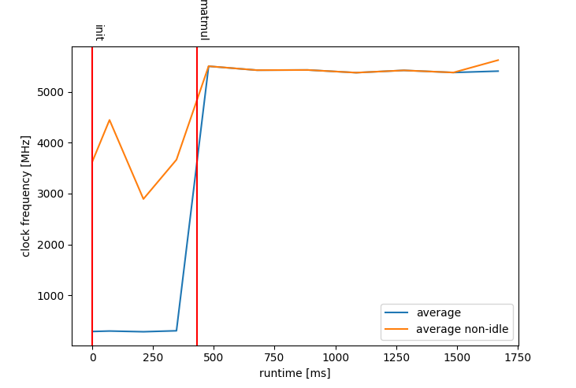

# hws - Hardware Sampling for CPUs and GPUs

The Hardware Sampling (hws) library can be used to track hardware performance like clock frequency, memory usage, temperatures, or power draw. 
It currently supports CPUs as well as GPUs from NVIDIA, AMD, and Intel.

## Getting Started

### Dependencies

General dependencies:

- a C++20 capable compiler supporting `std::format` (tested with GCC 14.1.0)
- [Pybind11 > v2.13.1](https://github.com/pybind/pybind11) if Python bindings are enabled (automatically build during the CMake configuration if it couldn't be found using the respective `find_package` call)

Dependencies based on the hardware to sample:

- if a CPU should be targeted: at least one of [`turbostat`](https://www.linux.org/docs/man8/turbostat.html) (may require root privileges), [`lscpu`](https://man7.org/linux/man-pages/man1/lscpu.1.html), or [`free`](https://man7.org/linux/man-pages/man1/free.1.html) and the [`subprocess.h`](https://github.com/sheredom/subprocess.h) library (automatically build during the CMake configuration if it couldn't be found using the respective `find_package` call)
- if an NVIDIA GPU should be targeted: NVIDIA's Management Library [`NVML`](https://docs.nvidia.com/deploy/nvml-api/)
- if an AMD GPU should be targeted: AMD's ROCm SMI library [`rocm_smi_lib`](https://rocm.docs.amd.com/projects/rocm_smi_lib/en/latest/doxygen/html/modules.html)
- if an Intel GPU should be targeted: Intel's [`Level Zero library`](https://spec.oneapi.io/level-zero/latest/core/INTRO.html)

### Building hws

To download the hardware sampling use:

```bash
git clone git@github.com:SC-SGS/hardware_sampling.git
cd hardware_sampling 
```

Building the library can be done using the normal CMake approach:

```bash
mkdir build && cd build 
cmake -DCMAKE_BUILD_TYPE=Release [optional_options] .. 
cmake --build . -j
```

#### Optional CMake Options

The `[optional_options]` can be one or multiple of:

- `HWS_ENABLE_ERROR_CHECKS=ON|OFF` (default: `OFF`): enable sanity checks during hardware sampling, may be problematic with smaller sample intervals
- `HWS_SAMPLING_INTERVAL=100ms` (default: `100ms`): set the sampling interval in milliseconds
- `HWS_ENABLE_PYTHON_BINDINGS=ON|OFF` (default: `ON`): enable Python bindings

### Installing

The library supports the `install` target:

```bash
cmake --install . --prefix "/home/myuser/installdir"
```

Afterward, the necessary exports should be performed:

```bash
export CMAKE_PREFIX_PATH=${CMAKE_INSTALL_PREFIX}/share/hardware_sampling/cmake:${CMAKE_PREFIX_PATH}
export LD_LIBRARY_PATH=${CMAKE_INSTALL_PREFIX}/lib:${LD_LIBRARY_PATH}
export CPLUS_INCLUDE_PATH=${CMAKE_INSTALL_PREFIX}/include:${CPLUS_INCLUDE_PATH}
export PYTHONPATH=${CMAKE_INSTALL_PREFIX}/lib:${PYTHONPATH}
```

## Available samples

### General samples

| sample              | CPUs  | NVIDIA GPUs | AMD GPUs  |  Intel GPUs  |
|:--------------------|:-----:|:-----------:|:---------:|:------------:|
| name                |  str  |     str     |    str    |     str      |
| vendor_id           |  str  |  str (fix)  |    str    | str (PCIe ID |
| architecture        |  str  |     str     |    str    |      ?       |
| byte_order          |  str  |  str (fix)  | str (fix) |  str (fix)   |
| compute_utilization |   %   |      %      |     %     |      ?       |
| memory_utilization  |   -   |      %      |     %     |      ?       |
| performance_level   |       |     int     |    int    |              |
| num_threads         |  int  |             |           |              |
| threads_per_core    |  int  |             |           |              |
| cores_per_socket    |  int  |             |           |              |
| num_sockets         |  int  |             |           |              |
| numa_nodes          |  int  |             |           |              |
| flags               |  str  |             |           |              |
| ipc                 | float |      -      |     -     |      -       |
| irq                 |  int  |      -      |     -     |      -       |
| smi                 |  int  |      -      |     -     |      -       |
| poll                |  int  |      -      |     -     |      -       |
| poll_percent        |   %   |      -      |     -     |      -       |
| persistence_mode    |       |    bool     |           |              |
| num_cores           |       |     int     |           |              |
| standby_mode        |       |             |           |     str      |
| num_threads_per_eu  |       |             |           |     int      |
| eu_simd_width       |       |             |           |     int      |

### clock-related samples

| sample                     | CPUs | NVIDIA GPUs | AMD GPUs | Intel GPUs |
|:---------------------------|:----:|:-----------:|:--------:|:----------:|
| frequency_boost            | bool |             |          |            |
| min_cpu_frequency          | MHz  |             |          |            |
| max_cpu_frequency          | MHz  |             |          |            |
| average_frequency          | MHz  |             |          |            |
| average_non_idle_frequency | MHz  |             |          |            |
| time_stamp_counter         | MHz  |             |          |            |
| clock_socket_min           |      |             |    Hz    |            |
| clock_socket_max           |      |             |    Hz    |            |
| clock_memory_min           |      |             |    Hz    |            |
| clock_memory_max           |      |             |    Hz    |            |
| clock_gpu_min              |      |     MHz     |    Hz    |    MHz     |
| clock_gpu_max              |      |     MHz     |    Hz    |    MHz     |
| clock_socket               |      |             |    Hz    |            |
| clock_memory               |      |             |    Hz    |            |
| clock_gpu                  |      |     MHz     |    Hz    |    MHz     |
| overdrive_level            |      |             |    %     |            |
| memory_overdrive_level     |      |             |    %     |            |
| available_clocks_gpu       |      |             |          |    MHz     |
| clock_mem_min              |      |     MHz     |          |    MHz     |
| clock_mem_max              |      |     MHz     |          |    MHz     |
| available_clocks_mem       |      |             |          |    MHz     |
| tdp_frequency_limit_gpu    |      |             |          |    MHz     |
| throttle_reason_gpu        |      |             |          |  bitmask   |
| tdp_frequency_limit_mem    |      |             |          |    MHz     |

### power-related samples

| sample                      | CPUs | NVIDIA GPUs | AMD GPUs | Intel GPUs |
|:----------------------------|:----:|:-----------:|:--------:|:----------:|
| package_power               |  W   |             |          |            |
| core_watt                   |  W   |             |          |            |
| dram_watt                   |  W   |             |          |            |
| package_rapl_throttling     |  %   |             |          |            |
| dram_rapl_throttling        |  %   |             |          |            |
| power_management_limit      |      |     mW      |   muW    |            |
| power_enforced_limit        |      |     mW      |   muW    |            |
| power_measurement_type      |      |             |   str    |            |
| available_power_profiles    |      |             |   str    |            |
| power_usage                 |      |     mW      |   muW    |            |
| power_total_energy_consumed |      |      J      |   muJ    |     J      |
| power_profile               |      |             |   str    |            |
| energy_threshold_enabled    |      |             |   bool   |            |
| energy_threshold            |      |             |    J     |            |
| power_management_mode       |      |    bool     |          |            |
| power_state                 |      |     int     |          |            |

### memory-related samples

| sample                      | CPUs | NVIDIA GPUs | AMD GPUs | Intel GPUs |
|:----------------------------|:----:|:-----------:|:--------:|:----------:|
| cache_size_L1d              | str  |             |          |            |
| cache_size_L1i              | str  |             |          |            |
| cache_size_L2               | str  |             |          |            |
| cache_size_L3               | str  |             |          |            |
| memory_total                |  B   |      B      |    B     |            |
| swap_memory_total           |  B   |             |          |            |
| memory_free                 |  B   |      B      |    B     |            |
| memory_used                 |  B   |      B      |    B     |            |
| swap_memory_free            |  B   |             |          |            |
| swap_memory_used            |  B   |             |          |            |
| visible_memory_total        |      |             |    B     |            |
| min_num_pcie_lanes          |      |             |   int    |            |
| max_num_pcie_lanes          |      |             |   int    |            |
| pcie_bandwidth              |      |    MBPS     |   T/s    |    MBPS    |
| num_pcie_lanes              |      |             |   int    |            |
| memory_total_{}             |      |             |          |     B      |
| allocatable_memory_total_{} |      |             |          |     B      |
| pcie_max_bandwidth          |      |    MBPS     |          |    BPS     |
| max_pcie_link_width         |      |             |          |    int     |
| max_pcie_link_generation    |      |     int     |          |    int     |
| memory_bus_width_{}         |      |             |          |    Bit     |
| memory_num_channels_{}      |      |             |          |    int     |
| memory_location_{}          |      |             |          |    str     |
| memory_free_{}              |      |             |          |     B      |
| memory_used_{}              |      |             |          |     B      |
| pcie_link_width             |      |     int     |          |    int     |
| pcie_link_generation        |      |     int     |          |    int     |
| memory_bus_width            |      |     Bit     |          |            |

### temperature-related samples

| sample                   | CPUs | NVIDIA GPUs | AMD GPUs | Intel GPUs |
|:-------------------------|:----:|:-----------:|:--------:|:----------:|
| per_core_temperature     |  °C  |             |          |            |
| core_throttle_percentage |  %   |             |          |            |
| per_package_temperature  |  °C  |             |          |            |
| num_fans                 |      |     int     |   int    |            |
| max_fan_speed            |      |             |   int    |            |
| temperature_gpu_min      |      |             |   m°C    |            |
| temperature_gpu_max      |      |     °C      |   m°C    |            |
| temperature_hotspot_min  |      |             |   m°C    |            |
| temperature_hotspot_max  |      |             |   m°C    |            |
| temperature_memory_min   |      |             |   m°C    |            |
| temperature_memory_max   |      |             |   m°C    |            |
| temperature_hbm_0_min    |      |             |   m°C    |            |
| temperature_hbm_0_max    |      |             |   m°C    |            |
| temperature_hbm_1_min    |      |             |   m°C    |    MBPS    |
| temperature_hbm_1_max    |      |             |   m°C    |            |
| temperature_hbm_2_min    |      |             |   m°C    |     B      |
| temperature_hbm_2_max    |      |             |   m°C    |     B      |
| temperature_hbm_3_min    |      |             |   m°C    |    BPS     |
| temperature_hbm_3_max    |      |             |   m°C    |    int     |
| fan_speed                |      |      %      |    %     |    int     |
| temperature_gpu          |      |     °C      |   m°C    |    Bit     |
| temperature_hotspot      |      |             |   m°C    |    int     |
| temperature_memory       |      |             |   m°C    |    str     |
| temperature_hbm_0        |      |             |   m°C    |     B      |
| temperature_hbm_1        |      |             |   m°C    |     B      |
| temperature_hbm_2        |      |             |   m°C    |    int     |
| temperature_hbm_3        |      |             |   m°C    |    int     |
| temperature_{}_max       |      |             |          |            |
| temperature_psu          |      |             |          |            |
| temperature_{}           |      |             |          |            |
| min_fan_speed            |      |      %      |          |            |
| max_fan_speed            |      |      %      |          |            |
| temperature_mem_max      |      |     °C      |          |            |

### gfx-related (iGPU) samples

| sample                     | CPUs |
|:---------------------------|:----:|
| graphics_render_state      |  %   |
| graphics_frequency         | MHz  |
| average_graphics_frequency | MHz  |
| gpu_state_c0               |  %   |
| cpu_works_for_gpu          |  %   |
| graphics_power             |  W   |

### "idle states"-related samples

| sample                           | CPUs |
|:---------------------------------|:----:|
| all_cpus_state_c0                |  %   |
| any_cpu_state_c0                 |  %   |
| lower_power_idle_state           |  %   |
| system_lower_power_idle_state    |  %   |
| package_lower_power_idle_state   |  %   |
| cpu_idle_state_{}_percentage     |  %   |
| package_idle_state_{}_percentage |  %   |
| package_idle_state_{}_percentage |  %   |
| idle_state_{}_percentage         |  %   |
| idle_state_{}                    | int  |


## Example Python usage

```python
import HardwareSampling
import numpy as np
import matplotlib.pyplot as plt
import datetime

sampler = HardwareSampling.CpuHardwareSampler()
# could also be, e.g.,
# sampler = HardwareSampling.GpuNvidiaHardwareSampler()
sampler.start()

sampler.add_event("init")
A = np.random.rand(2**14, 2**14)
B = np.random.rand(2**14, 2**14)

sampler.add_event("matmul")
C = A @ B

sampler.stop()
sampler.dump_yaml("track.yaml")

# plot the results
time_points = sampler.time_points()
relative_time_points = [(t - time_points[0]) / datetime.timedelta(milliseconds=1) for t in time_points]

plt.plot(relative_time_points, sampler.clock_samples().get_average_frequency(), label="average")
plt.plot(relative_time_points, sampler.clock_samples().get_average_non_idle_frequency(), label="average non-idle")

axes = plt.gcf().axes[0]
x_bounds = axes.get_xlim()
for event in sampler.get_events()[1:-1]:
    tp = (event.time_point - time_points[0]) / datetime.timedelta(milliseconds=1)

    axes.axvline(x=tp, color='r')
    axes.annotate(text=event.name, xy=(((tp - x_bounds[0]) / (x_bounds[1] - x_bounds[0])), 1.025), xycoords='axes fraction', rotation=270)

plt.xlabel("runtime [ms]")
plt.ylabel("clock frequency [MHz]")
plt.legend()
plt.show()
```

<p align="center">
  
</p>

## License

The hws library is distributed under the [MIT license](https://github.com/SC-SGS/hardware_sampling/blob/main/LICENSE.md).